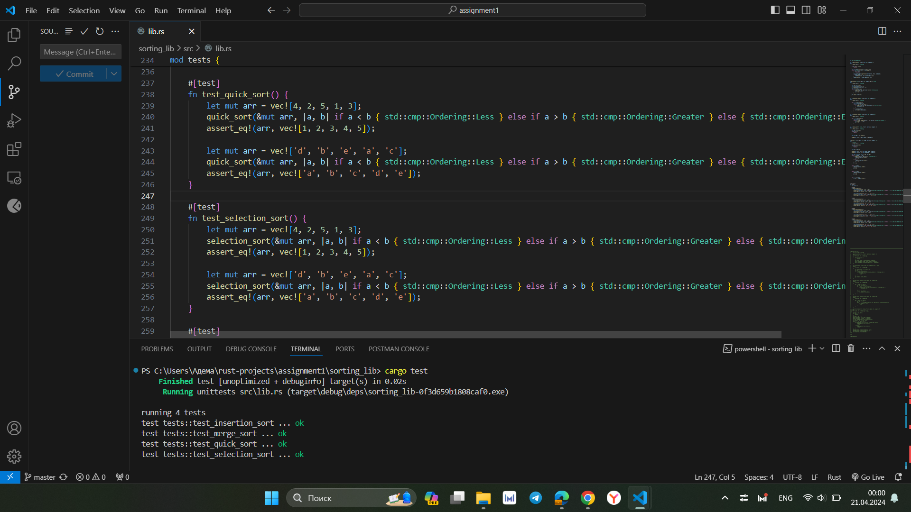
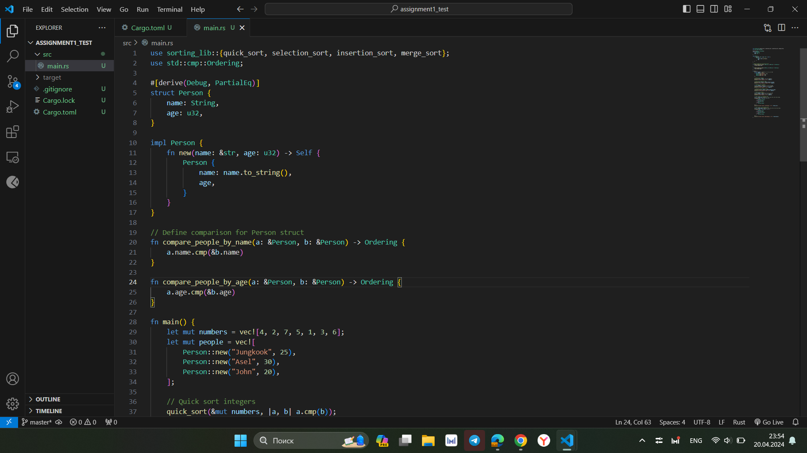
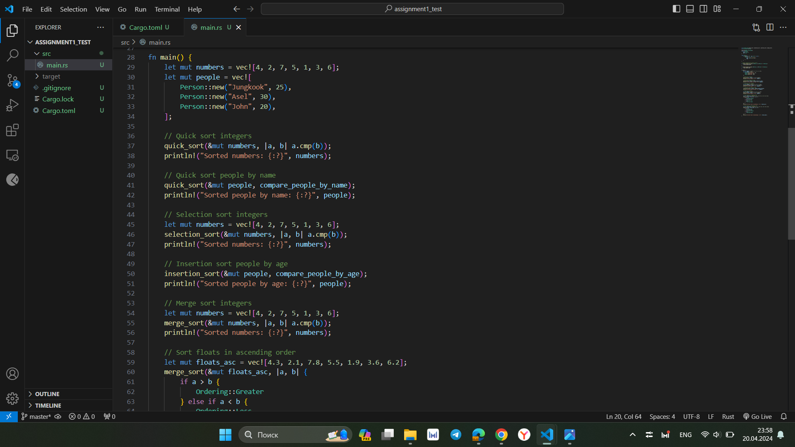
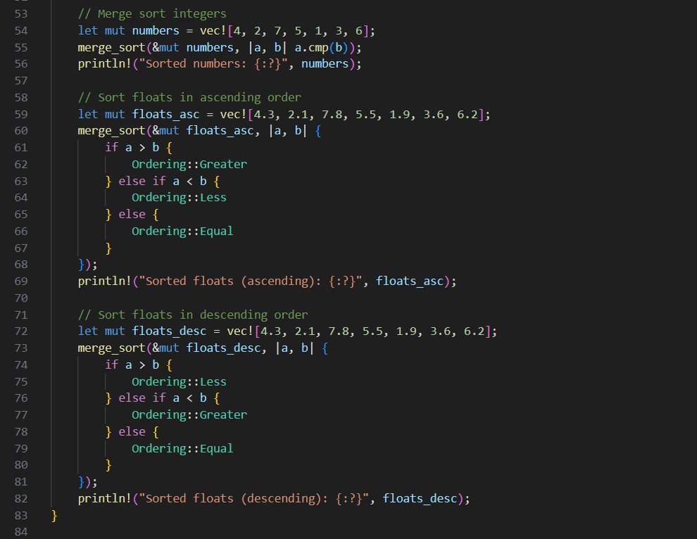
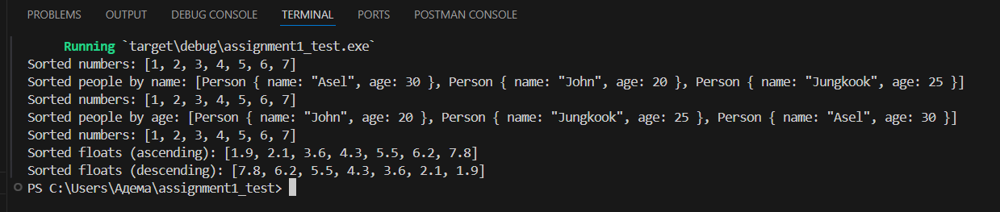

## Sorting Library - sorting_lib
This library provides sorting functions for different data types using algorithms like quick sort, select sort, insert sort, and merge sort.

## Usage

1. Clone the repository:

```bash
https://github.com/ademashauenova/sorting_lib
``` 
2. Navigate to the project directory:
```bash
cd sorting_lib
```
3. Test the code:
```bash
cargo test
```

4. Use sorting functions in your own code





The outputs:


### Examples
Here are example code snippets:

```rust
let mut numbers = vec![4, 2, 7, 5, 1, 3, 6];
quick_sort(&mut numbers, |a, b| a.cmp(b));
println!("Sorted numbers: {:?}", numbers);
```


```rust
let mut floats_asc = vec![4.3, 2.1, 7.8, 5.5, 1.9, 3.6, 6.2];
merge_sort(&mut floats_asc, |a, b| {
  if a > b {
    Ordering::Greater
  } else if a < b {
    Ordering::Less
  } else {
    Ordering::Equal
  }
});
println!("Sorted floats (ascending): {:?}", floats_asc);
```


```rust
// Definition of Person struct


let mut people = vec![
  Person::new("Jungkook", 25),
  Person::new("Asel", 30),
  Person::new("John", 20),
];

// Quick sort people by name
quick_sort(&mut people, compare_people_by_name);
println!("Sorted people by name: {:?}", people);

// Insertion sort people by age
insertion_sort(&mut people, compare_people_by_age);
println!("Sorted people by age: {:?}", people);
```
